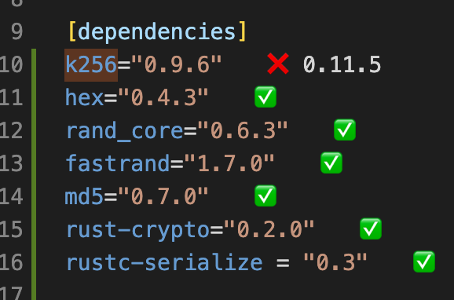

# keystore quality and security code audit

## Executive summary

This report is a quality and security audit of the crate [keystore](./keystore).  
We provide first a code quality analysis without consideration of security flaws, as quality applied even for a flawed code.  
We follow with a security analysis.  
A corrected version of the crate `keystore` with quality and security considerations applied can be found at [keystore-update](./keystore-update).

## Quality audit

Without an internal convention written for this project, we assume rust official conventions should be followed for rust syntax and design.

### Cargo.toml

#### package section

- Use a meaningful package name like `keystore` instead of `app2` for the field `name` or at least use a `[[bin]]` target to generate a binary with a meaningful name:

```toml
[package]
name = "keystore"
```

or/and

```toml
[[bin]]
name = "keystore"
path = "src/main.rs"
```

- Upgrade to the last Rust Edition `2021` instead of `2018`:

```toml
edition = "2021"
```

- Important metada are missing. `authors`, `licence`, `repository`, `documentation`, and more fields should be filled with correct values.
  Please see https://doc.rust-lang.org/cargo/reference/manifest.html#the-package-section for more information.

#### dependencies section

- Remove commented dependency at line 10 and the useless blank line at line 11:

```toml
#primitive-types = "0.10.0"

```

- Outdated crate `k256`. The version used is `0.9.6` and the last version is `0.11.5`.
  Use an IDE extension like [crates](https://marketplace.visualstudio.com/items?itemName=serayuzgur.crates) for VSCode, the builtin `cargo search` command for finding last releases of crates or manually search for a crate on https://crates.io and follow install instructions.

_`crates` extension output on VSCode IDE_:



_output of_ `cargo search k256 --limit 3` _command_ :

```zsh
$ cargo search k256 --limit 3
k256 = "0.11.5"         # secp256k1 elliptic curve library written in pure Rust with support for ECDSA signing/verification (incl…
elabs-k256 = "0.1.1"    # Elabs K256: Keccak-256 wrapper
k256_flow = "1.0.0"     # Flow-Rust-SDK Version of k256 secp256k1 elliptic curve library written in pure Rust with support for EC…
... and 17 crates more (use --limit N to see more)
```

_install instructions on https://crates.io/crates/k256_ :

```text
Install

Add the following line to your Cargo.toml file:
k256 = "0.11.5"
```

\*\*Important Security Warning\*\*:

`k256` is an unaudited package. We just showed how to get the last version of the package, but for security reason, and particulary for application using cryptography you should use an alternative. See our security analysis below for more information. TODO LINK TO SEC HERE.

### Consistency in code formating

Readablity can be improve by consistency in formating

- indentation
- rustfmt

### Clippy

a clippy run

### Modularity

- separate lib code and bin code

### Consistency in import

### Variable mutability

### Program exit and error code

### Comment

### Documentation comment

### Unit testing

### Portability

### notes

https://github.com/rust-dev-tools/fmt-rfcs/blob/master/guide/guide.md
https://rust-lang.github.io/api-guidelines/

## Security

### report overview

```

```
